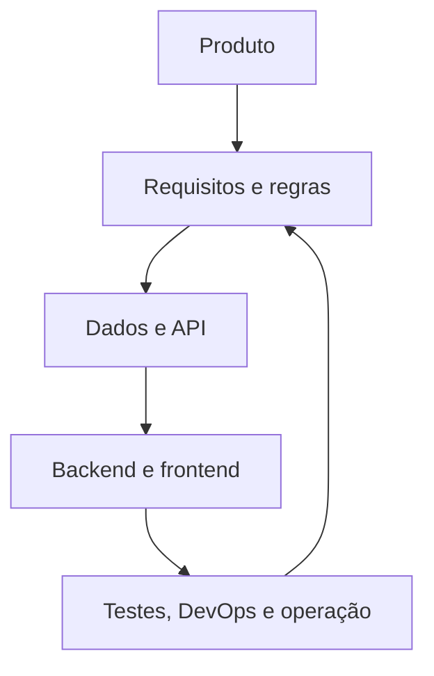

# Mapa da documentação

**ID:** DOC-GOV-001  
**Fonte canônica para:** localização, finalidade e dependência dos documentos  
**Não redefine:** requisitos, regras, campos ou decisões técnicas

## 1. Princípio de navegação

O pacote possui quatro tipos de informação:

1. **Negócio:** por que e para quem o produto existe.
2. **Contrato:** o que o produto deve fazer e quais dados troca.
3. **Implementação:** como a equipe deve transformar os contratos em software.
4. **Operação:** como entregar, observar, suportar e vender o serviço.

## 2. Mapa por pasta

| Pasta | Responsabilidade | Consome |
|---|---|---|
| `00-governanca` | Padrões, termos, decisões e pendências | Todas |
| `01-produto-negocio` | Visão, proposta de valor e modelo comercial | Governança |
| `02-requisitos` | Requisitos, regras, permissões e metas | Produto |
| `03-dominio-dados` | Entidades, campos e relacionamentos | Requisitos e regras |
| `04-arquitetura-backend` | Arquitetura Java/Spring e responsabilidades | Dados, requisitos e ADRs |
| `05-api-integracoes` | Contrato HTTP e fornecedores externos | Dados, regras e permissões |
| `06-frontend-ux` | Telas, rotas e jornadas | API, requisitos e design system |
| `07-design-system` | Tokens e componentes visuais | WCAG e identidade Varthex |
| `08-seguranca` | Controles de segurança e privacidade | Arquitetura, dados e LGPD |
| `09-testes` | Estratégia, casos críticos e rastreabilidade | Todos os contratos |
| `10-devops` | Fluxo de entrega, ambientes e operação | Arquitetura e testes |
| `11-comercial` | Implantação, suporte e artefatos jurídicos | Produto e operação |
| `12-roadmap` | Releases, equipe e sequência de execução | Requisitos |
| `13-referencias` | Fontes oficiais e sua aplicação | Todos |
| `modelos` | Templates para evolução controlada | Governança |
| `scripts` | Validação automática da documentação | Manifesto e fontes canônicas |

## 3. Fluxo entre fontes

O retorno de `Q` para `R` representa aprendizado de testes e piloto. Mudanças não são feitas diretamente na implementação; primeiro alteram o contrato canônico.

## 4. Responsável por aprovação

| Tipo | Autor principal | Aprovação mínima |
|---|---|---|
| Produto e regra | Pessoa 1 | Pessoa 2 e Product Owner |
| Dados e API | Pessoa 2 | Pessoa 1 e Pessoa 4 |
| UX e design | Pessoa 3 | Pessoa 1 e Pessoa 4 |
| Segurança e testes | Pessoa 4 | Pessoa 2 e Pessoa 5 |
| Infraestrutura | Pessoa 5 | Pessoa 2 e Pessoa 4 |

## 5. Estados documentais

- `RASCUNHO`: incompleto; não autoriza implementação.
- `EM_REVISAO`: conteúdo completo aguardando aprovação.
- `APROVADO`: pode orientar implementação.
- `SUBSTITUIDO`: mantido apenas no histórico.
- `BLOQUEADO`: depende de uma decisão registrada.

## 6. Regra de conflito

Se dois documentos aparentarem discordar:

1. consulte a tabela de fontes canônicas do `README`;
2. siga o documento canônico;
3. registre a divergência em `05-pendencias-premissas.md`;
4. corrija o consumidor, sem copiar a definição para ele;
5. acrescente ADR quando houver mudança arquitetural.

