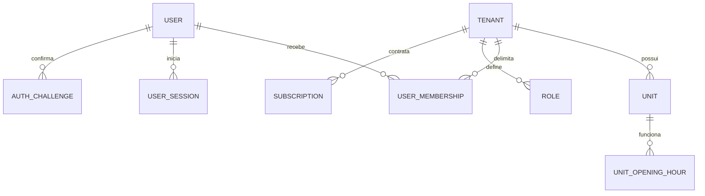
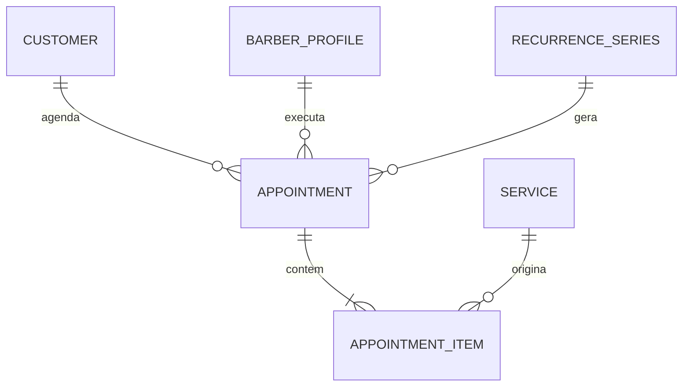
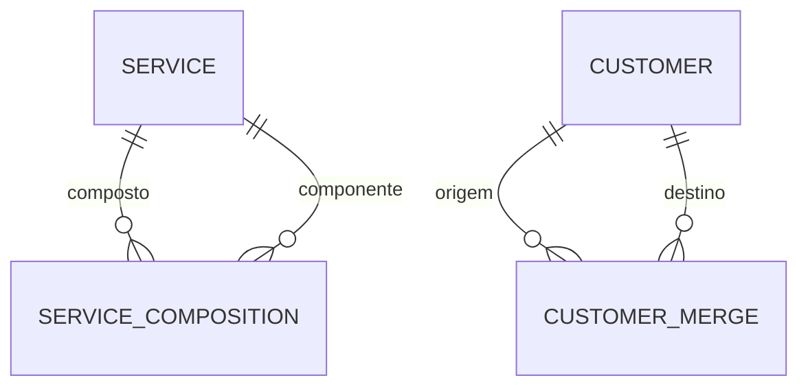
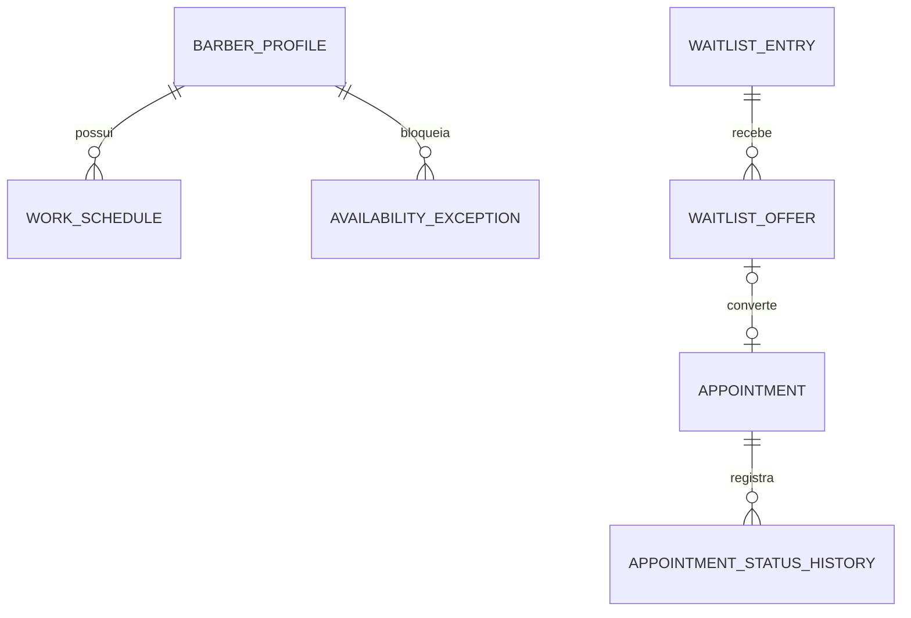
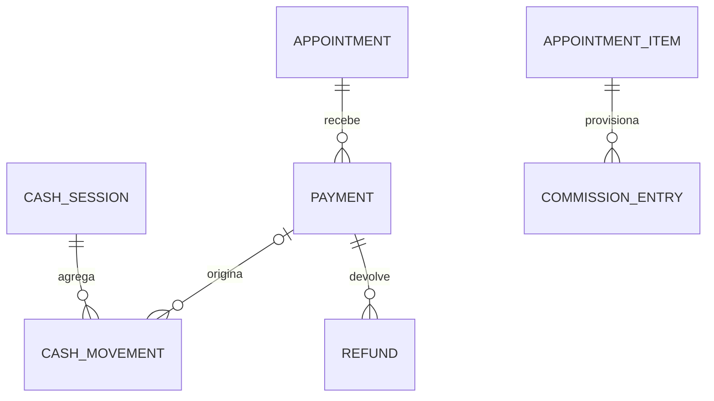
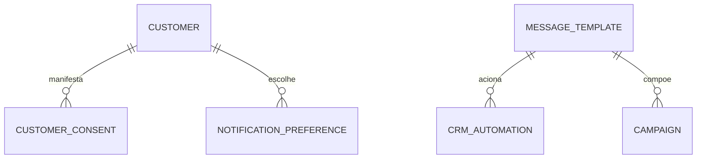
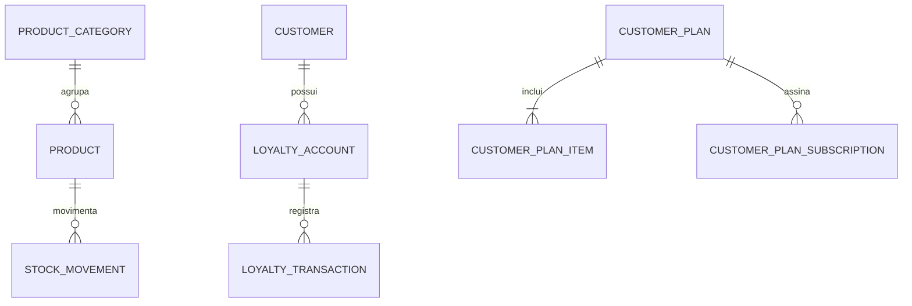

# Modelo de dados e relacionamentos

**ID:** DOC-DAD-003  
**Status:** aprovado  
**Fonte canônica de entidades:** [`01-catalogo-entidades.md`](01-catalogo-entidades.md)  
**Fonte canônica de campos:** [`catalogo-dados.csv`](catalogo-dados.csv)

Os diagramas são visões dos relacionamentos; não redefinem campos.

## 1. Identidade e tenant

## 2. Catálogo e agenda

## 3. Financeiro

## 4. Comunicação e CRM

## 5. Estoque e fidelidade

## 6. Restrições obrigatórias

- `users.email` único normalizado globalmente.
- `user_memberships`: único por `tenant_id`, `user_id`, papel e unidade vigente.
- `barber_profiles`: único por `tenant_id`, `user_id`.
- `unit_opening_hours`: faixas do mesmo dia e unidade não se sobrepõem; usam intervalo semiaberto.
- `barber_services`: único por `tenant_id`, `barber_id`, `service_id`.
- `service_compositions`: par pai/componente único, sem autorreferência nem ciclos.
- `notification_preferences`: exatamente um destinatário (`user_id` ou `customer_id`) e chave única por destinatário, tipo e canal.
- `customer_consents`: append-only; o estado efetivo é a manifestação mais recente por cliente, finalidade e canal.
- `customer_merges`: origem e destino distintos, mesmo tenant e somente uma união ativa por origem.
- `roles`: `role_key` único por tenant; papel de sistema não pode ser excluído.
- `loyalty_accounts`: único por `tenant_id`, `program_id`, `customer_id`.
- `customer_plan_items`: par `plan_id`, `service_id` único.
- idempotency keys: únicas no tenant e contexto da operação.
- pagamentos de um mesmo recebimento compartilham `group_id`; o comando grava todos ou nenhum e a soma obedece `RN-PAG-005`.
- política de sinal exige valor quando modalidade for percentual/fixa; agendamento `PENDING` de sinal exige valor e vencimento.
- `deposit_amount`, descontos, acréscimos, gorjetas e valores financeiros são não negativos; sinal fixo não excede o total.
- `stock_movements`, `cash_movements`, `commission_entries`, `loyalty_transactions`, históricos e auditoria são append-only.
- FKs tenant-owned precisam apontar para o mesmo tenant.

## 7. Concorrência da agenda

Além da consulta de disponibilidade, o PostgreSQL deve impedir sobreposição de intervalos ativos para o mesmo `tenant_id`, `unit_id` e `barber_id`. A migration pode usar uma restrição de exclusão com range temporal e predicado de status, depois de validar compatibilidade e extensão necessária.

O objetivo verificável é `RNF-DAD-001`; a implementação exata fica registrada na migration e em ADR complementar se mudar.

## 8. Índices iniciais

- agenda: `(tenant_id, unit_id, barber_id, start_at)`;
- agenda do cliente: `(tenant_id, customer_id, start_at desc)`;
- fila: `(tenant_id, unit_id, status, window_start_at)`;
- comissão: `(tenant_id, barber_id, created_at)`;
- notificações: `(status, scheduled_at)` e `(tenant_id, dedupe_key)` único;
- outbox: `(status, next_attempt_at)`;
- estoque: `(tenant_id, unit_id, product_id, occurred_at)`;
- auditoria: `(tenant_id, created_at desc)` e `(resource_type, resource_id)`;
- assinatura: `(tenant_id, status)`.
- consentimento: `(tenant_id, customer_id, purpose, channel, occurred_at desc)`.
- desafio de autenticação: `(user_id, type, expires_at)` com limpeza por expiração.

Índices adicionais devem ser orientados por consultas e métricas, não por antecipação.

## 9. Retenção e exclusão

- cadastro arquivável utiliza soft delete;
- transações permanecem imutáveis pelo prazo aprovado;
- dados de autenticação expirados são removidos por política operacional;
- payloads de integração e logs têm retenção menor e sanitização;
- encerramento do tenant segue exportação, janela de recuperação e eliminação aprovada em `PEND-LEG-003`.
