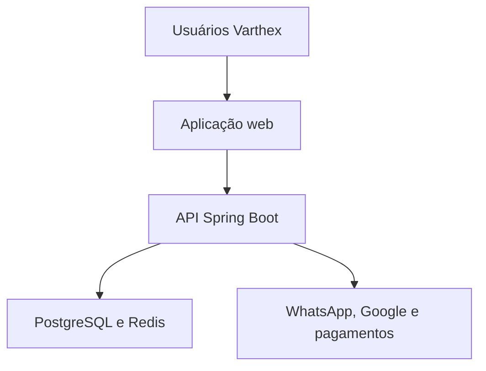
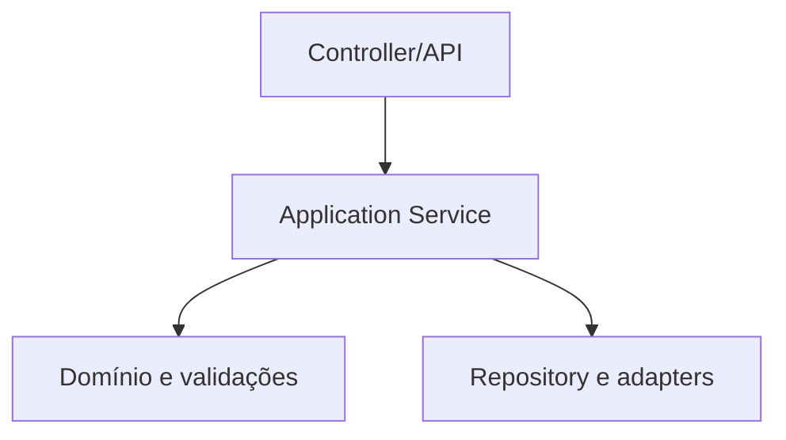
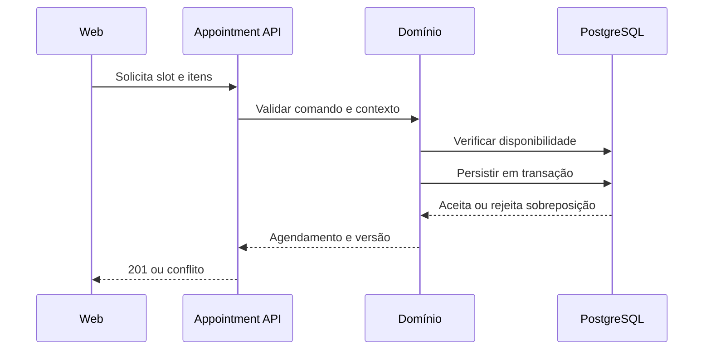

# Arquitetura do sistema

**ID:** DOC-ARQ-001  
**Status:** aprovado  
**Fonte canônica para:** limites do sistema, módulos e comunicação

## 1. Visão de contexto

## 2. Containers lógicos

| Componente | Responsabilidade | Estado |
|---|---|---|
| Web Next.js | Interface, rotas, acessibilidade e consumo do contrato | Stateless |
| API Spring Boot | Autenticação, regras, autorização, transações e integrações | Stateless |
| Worker lógico | Jobs assíncronos no mesmo código-base ou processo separado | Recuperável |
| PostgreSQL | Fonte transacional e auditoria | Persistente |
| Redis | Cache, rate limit, lock ou fila aprovada | Efêmero |
| Storage | Logos, exportações temporárias e comprovantes permitidos | Persistente |
| Fornecedores | WhatsApp, Google, pagamento e e-mail | Externos |

## 3. Estilo do backend

O backend é um monólito modular. Cada módulo:

- possui pacote raiz próprio;
- expõe serviços de aplicação ou eventos;
- mantém repositories e Entities internos;
- não acessa internals de outro módulo;
- publica eventos somente depois da confirmação transacional, via outbox quando necessário;
- possui testes de módulo e arquitetura.

Spring Modulith pode ser adotado para validar dependências, documentar módulos e testar seus limites. Sua inclusão é uma decisão de implementação compatível com `ADR-001`.

## 4. Camadas dentro do módulo

### Controller

- converte HTTP em comando/consulta;
- valida forma do payload;
- obtém identidade e contexto;
- chama um caso de uso;
- não calcula regra;
- não acessa repository.

### Application Service

- implementa caso de uso;
- inicia transação;
- verifica autorização contextual;
- coordena domínio, repositories e eventos;
- retorna DTO ou resultado de aplicação.

### Domínio

- representa estados e invariantes;
- calcula valores e transições;
- não depende de HTTP, Next.js ou fornecedor.

### Repository e adapter

- persiste agregado;
- sempre aplica tenant;
- integra serviço externo por interface;
- converte falha externa para erro de integração conhecido.

## 5. Fluxo crítico de agendamento

## 6. Multi-tenancy

- filtro explícito em repository;
- tenant obtido por `TenantContext`;
- IDs nunca são considerados autorização;
- entidades relacionadas são carregadas pelo mesmo tenant;
- cache inclui tenant na chave;
- eventos carregam tenant e versão do schema;
- métricas evitam expor nomes;
- testes tentam acessar, alterar e relacionar registros externos.

Para defesa adicional futura pode-se avaliar Row-Level Security, sem substituir os controles da aplicação.

## 7. Consistência e transações

- um caso de uso altera um agregado principal por transação sempre que possível;
- agenda, caixa, pagamento, comissão e estoque possuem fronteiras explícitas;
- integração externa não permanece dentro de transação de banco longa;
- outbox registra o evento junto da alteração transacional;
- worker entrega e marca o evento;
- retries são idempotentes;
- concorrência otimista usa `version`;
- conflito de agenda possui garantia física adicional.

## 8. Cache

Pode armazenar:

- catálogo público de serviços por poucos minutos;
- direitos de plano com invalidação;
- disponibilidade calculada com TTL curto;
- rate limiting.

Não pode armazenar como única cópia:

- agendamento;
- pagamento;
- comissão;
- estoque;
- consentimento;
- auditoria.

## 9. Falhas

Categorias padronizadas:

- validação;
- não autenticado;
- não autorizado;
- não encontrado;
- conflito;
- limite de plano;
- integração temporária;
- integração definitiva;
- erro interno.

Erro interno retorna correlation ID e mensagem segura. Detalhes ficam apenas nos logs.

## 10. Evolução

Um módulo somente vira serviço independente se houver:

- necessidade mensurável de escala diferente;
- equipe proprietária independente;
- domínio e dados suficientemente estáveis;
- ganho maior que custo operacional;
- contrato idempotente e observável;
- plano de migração e consistência.

