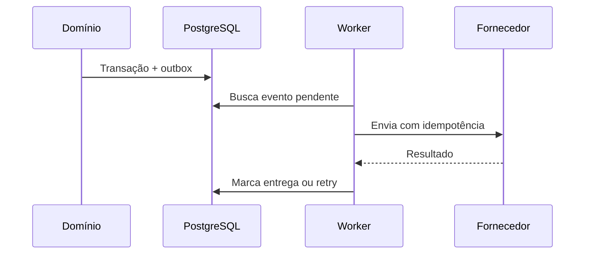

# Integrações externas

**ID:** DOC-API-002  
**Status:** arquitetura aprovada; fornecedores pendentes  
**Fonte canônica para:** responsabilidades, falhas, dados e segurança de integrações

## 1. Padrão de adapter

Cada integração possui:

- interface no módulo consumidor;
- adapter do fornecedor;
- DTO externo isolado;
- conexão por tenant/unidade;
- timeout;
- retry somente em erro temporário;
- circuit breaker quando justificado;
- idempotência;
- métricas;
- armazenamento de referência de credencial;
- runbook.

O domínio não importa SDK do fornecedor.

## 2. Outbox e webhooks

Webhooks de entrada:

1. verificar assinatura;
2. validar timestamp/replay;
3. registrar ID externo;
4. responder rapidamente;
5. processar assincronamente;
6. reconciliar tenant e objeto esperado;
7. manter payload mínimo sanitizado;
8. deduplicar.

## 3. WhatsApp — `INT-WHATSAPP`

### Release

Intermediário.

### Casos

- confirmação;
- lembrete;
- cancelamento e reagendamento;
- oferta de fila;
- lembrete de corte;
- solicitação de avaliação;
- aviso operacional.

### Requisitos

- API oficial ou parceiro autorizado;
- templates e idiomas versionados;
- opt-in/opt-out;
- janela e categoria da mensagem;
- status enviado, entregue, lido quando fornecido e falha;
- custo por conversa/mensagem registrado fora do código;
- limite por plano;
- retry sem duplicidade;
- número e conta vinculados ao tenant/unidade.

### Dados enviados

Nome mínimo, telefone, horário, serviço, profissional e link de ação. Observações internas, comissão e dados excessivos não são enviados.

### Contingência

Falha não cancela o agendamento. O painel alerta e permite canal alternativo.

## 4. Google Calendar — `INT-GOOGLE-CALENDAR`

### Release

Intermediário.

### Autorização

- OAuth 2.0 para aplicação web;
- menor conjunto de escopos;
- `state` contra CSRF;
- refresh token criptografado/referenciado;
- revogação e reconexão.

### Sincronização

- Varthex é a fonte oficial do agendamento;
- evento externo armazena ID e versão;
- criar, atualizar e cancelar são idempotentes;
- falha fica pendente e visível;
- conflitos externos são sinalizados; não reescrevem silenciosamente a agenda;
- fuso da unidade e recorrência são preservados.

## 5. Avaliação Google — `INT-GOOGLE-REVIEW`

- barbearia cadastra link oficial de solicitação;
- envio após atendimento concluído;
- frequência evita repetição;
- não oferecer desconto ou vantagem em troca;
- registrar envio e clique quando permitido;
- avaliação em si não precisa ser copiada para o Varthex no nível intermediário.

## 6. Gateway de pagamento — `INT-PAYMENT`

Há dois contextos:

1. cobrança da assinatura Varthex;
2. pagamento do cliente à barbearia.

Eles têm configurações e razões separadas.

### Controles

- webhooks assinados;
- IDs externos únicos;
- moeda e valor reconciliados;
- idempotency key;
- estados intermediários;
- reembolso como entidade;
- nenhum dado completo de cartão persistido;
- conciliação e runbook.

## 7. E-mail — `INT-EMAIL`

- domínio autenticado;
- templates versionados;
- tracking limitado e documentado;
- lista de supressão;
- bounce e complaint;
- rate limit;
- alertas de reputação.

## 8. Matriz de falhas

| Falha | Classificação | Ação |
|---|---|---|
| Timeout/5xx | Temporária | Retry com backoff |
| Rate limit | Temporária | Respeitar `Retry-After` |
| Token expirado | Recuperável | Renovar ou solicitar reconexão |
| Credencial revogada | Definitiva até ação | Marcar conexão expirada |
| Template rejeitado | Definitiva | Corrigir template |
| Payload inválido | Definitiva | Registrar erro sanitizado |
| Assinatura inválida | Segurança | Rejeitar e alertar |
| Duplicidade | Idempotente | Retornar resultado conhecido |

## 9. Critério de contratação

Para cada fornecedor registrar custo, SLA, região, subprocessadores, retenção, exportação, suporte, ambiente de testes, limites, segurança, política de dados e estratégia de saída.

