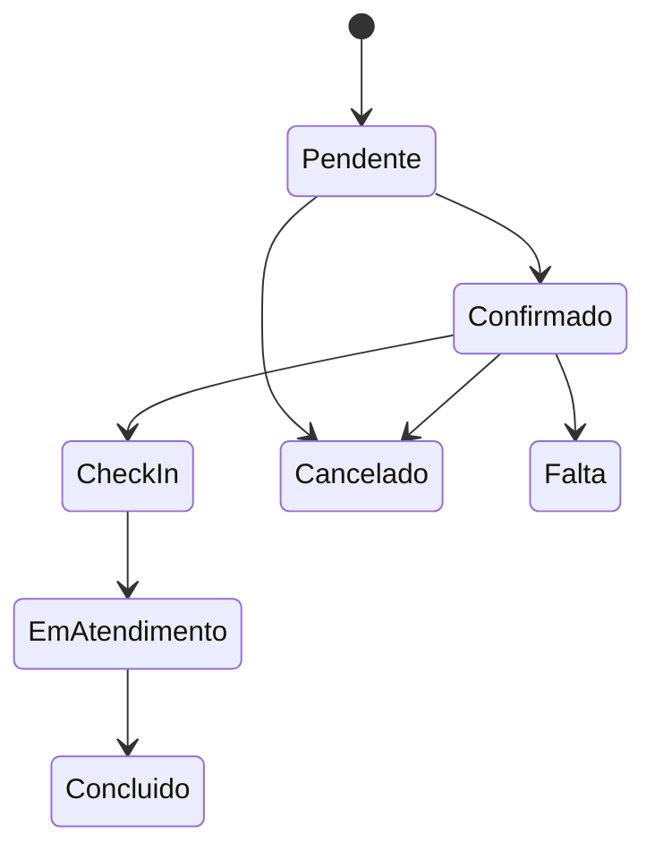

# Catálogo de telas e fluxos

**ID:** DOC-FE-002  
**Status:** aprovado  
**Fonte canônica para:** existência, objetivo e dependências das telas

## 1. Estados obrigatórios

Toda tela define:

- carregando;
- vazio;
- erro recuperável;
- erro definitivo;
- sem permissão;
- offline/degradado quando relevante;
- sucesso;
- conflito de versão;
- confirmação de ação destrutiva.

## 2. Telas MVP

| ID | Tela | Perfil | Requisitos | API principal |
|---|---|---|---|---|
| `TEL-AUT-LOGIN` | Login | Todos | `RF-AUT-001` | `login` |
| `TEL-AUT-RECOVERY` | Recuperação de senha | Público | `RF-AUT-005` | `requestPasswordRecovery` |
| `TEL-DASH-OVERVIEW` | Dashboard | Admin/Barber | `RF-REL-001..003` | `getDashboardOverview` |
| `TEL-AGE-CALENDAR` | Agenda diária/semanal | Admin/Barber | `RF-AGE-001..015` | `listAppointments` |
| `TEL-AGE-EDITOR` | Criar/editar agendamento | Admin/Barber/Cliente | `RF-AGE-001..014` | `createAppointment`, `updateAppointment` |
| `TEL-CLI-LIST` | Clientes | Admin/Barber | `RF-CLI-001..006` | `listCustomers` |
| `TEL-CLI-DETAIL` | Cliente e histórico | Admin/Barber/Cliente | `RF-CLI-002..007` | `getCustomer` |
| `TEL-BAR-LIST` | Equipe | Admin | `RF-BAR-001..004` | `listBarbers` |
| `TEL-SER-LIST` | Serviços | Admin | `RF-SER-001..006` | `listServices` |
| `TEL-DIS-SCHEDULE` | Disponibilidade | Admin/Barber | `RF-DIS-001..006` | disponibilidade e bloqueios |
| `TEL-FIL-QUEUE` | Fila de espera | Admin/Barber | `RF-FIL-001..005` | `listWaitlistEntries` |
| `TEL-COM-SUMMARY` | Comissões | Admin/Barber | `RF-COM-001..005` | `getCommissionSummary` |
| `TEL-NOT-CENTER` | Notificações | Autenticado | `RF-NOT-001..004` | `listNotifications` |
| `TEL-TEN-SETTINGS` | Configurações | Admin | `RF-TEN-002..005` | `getCurrentTenant`, `updateCurrentTenant` |
| `TEL-USR-TEAM` | Usuários e convites | Admin | `RF-USR-001..006` | `listUsers`, `inviteUser` |
| `TEL-ADM-TENANTS` | Tenants | Super Admin | `RF-ADM-001..003` | `adminListTenants` |
| `TEL-BOOK-CLIENT` | Reserva autenticada | Cliente com acesso | `RF-AGE-002` | `getBarberAvailability`, `createAppointment` |
| `TEL-CLIENT-APPOINTMENTS` | Minhas reservas | Cliente | `RF-CLI-007` | agenda própria |

## 3. Telas intermediárias

| ID | Tela | Perfil | Requisitos |
|---|---|---|---|
| `TEL-ONB-WIZARD` | Onboarding | Admin | Tenant, equipe, serviço e primeira agenda |
| `TEL-BOOK-PUBLIC` | Reserva sem conta e catálogo público | Público | `RF-AGE-017..018` |
| `TEL-CXA-CURRENT` | Caixa atual | Admin/Manager/Cashier | `RF-CXA-001..006` |
| `TEL-PAG-CHECKOUT` | Recebimento | Admin/Cashier | `RF-PAG-001..006` |
| `TEL-EST-PRODUCTS` | Produtos | Admin/Manager | `RF-EST-001..010` |
| `TEL-EST-MOVEMENTS` | Movimentos e inventário | Admin/Manager | `RF-EST-003..010` |
| `TEL-FID-PROGRAM` | Fidelidade | Admin/Manager | `RF-FID-001..008` |
| `TEL-CRM-TEMPLATES` | Templates | Admin/Manager | `RF-CRM-003..005` |
| `TEL-CRM-CUSTOMERS` | Segmentos | Admin/Manager | `RF-CRM-001..006` |
| `TEL-INT-CONNECTIONS` | Integrações | Admin | `RF-INT-001..005` |
| `TEL-ASS-PLAN` | Plano e consumo | Admin | `RF-ASS-001..009` |
| `TEL-REL-REPORTS` | Relatórios | Admin/Manager | `RF-REL-005..012` |
| `TEL-ADM-BILLING` | Assinaturas | Super Admin | `RF-ADM-004..008` |

## 4. Telas finais

| ID | Tela | Perfil | Requisitos |
|---|---|---|---|
| `TEL-UNIT-SWITCHER` | Seletor de unidade | Gestores | `RF-TEN-007..010` |
| `TEL-UNIT-CONSOLIDATED` | Visão consolidada | Admin/Manager | `RF-REL-013` |
| `TEL-CRM-CAMPAIGNS` | Campanhas | Admin/Marketing | `RF-CRM-007..010` |
| `TEL-EST-PURCHASES` | Compras | Admin/Estoque | `RF-EST-011` |
| `TEL-EST-TRANSFERS` | Transferências | Admin/Estoque | `RF-EST-012` |
| `TEL-REL-GOALS` | Metas | Admin/Manager | `RF-REL-014` |
| `TEL-REL-BI` | BI e sugestões | Admin | `RF-REL-015..017` |
| `TEL-DEV-API` | Chaves e webhooks | Admin técnico | `RF-INT-006..007` |

## 5. Fluxo de criação de agendamento

1. selecionar unidade;
2. identificar cliente;
3. selecionar serviços;
4. selecionar profissional ou “qualquer disponível” quando aprovado;
5. buscar slots;
6. selecionar horário;
7. revisar duração, preço e política;
8. confirmar;
9. exibir resultado e ações;
10. notificação ocorre em segundo plano.

Em conflito, a tela preserva cliente e serviços, atualiza slots e solicita nova escolha.

## 6. Fluxo operacional

Botões aparecem apenas para transições válidas. O backend continua verificando.

## 7. Fluxo de caixa

1. abrir caixa e informar saldo;
2. realizar atendimentos e vendas;
3. registrar pagamentos;
4. registrar suprimento/sangria com motivo;
5. conferir movimentos;
6. informar valor contado;
7. visualizar diferença;
8. confirmar fechamento;
9. emitir resumo.

## 8. Conteúdo e linguagem

- linguagem direta e humana;
- erros explicam como corrigir;
- evitar termos internos como repository ou constraint;
- valores e datas localizados;
- ações destrutivas usam verbo específico;
- não usar cores como único indicador;
- títulos e labels seguem glossário.
