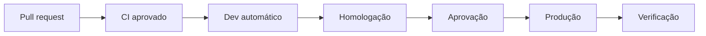

# Metodologia DevOps

**ID:** DOC-OPS-001  
**Status:** baseline  
**Fonte canônica para:** fluxo de entrega, controles de pipeline e responsabilidade operacional

## 1. Princípios

1. Produto, desenvolvimento, qualidade, segurança e operação compartilham a entrega.
2. Toda mudança nasce rastreável a requisito, regra, incidente, risco ou ADR.
3. A mesma revisão promove o contrato, o código, a migration, o teste e a documentação afetados.
4. Artefatos são construídos uma vez, identificados por commit e promovidos entre ambientes sem recompilação.
5. Automação substitui procedimentos manuais repetíveis; decisões de risco continuam explícitas.
6. Produção deve ser observável, restaurável e operável antes de ser considerada pronta.

## 2. Fluxo de trabalho

O projeto adota fluxo baseado em `main` protegido e branches curtas.

| Elemento | Regra |
|---|---|
| Branch principal | `main`, sempre implantável |
| Branch de trabalho | `feature/<id>-descricao`, `fix/<id>-descricao`, `docs/<id>-descricao` |
| Vida da branch | Preferencialmente até dois dias úteis; dividir entregas maiores por feature flag |
| Commit | Conventional Commits: `feat`, `fix`, `docs`, `test`, `refactor`, `perf`, `build`, `ci`, `chore`, `revert` |
| Pull request | Pequeno, com contexto, risco, evidência e plano de reversão |
| Aprovação | Ao menos uma pessoa diferente da autora; duas em segurança, migrations destrutivas e produção crítica |
| Merge | Squash; título do PR vira commit rastreável |
| Versão | SemVer; prerelease em homologação e tag `vX.Y.Z` para produção |
| Hotfix | Branch curta a partir de `main`, mesmos controles e revisão posterior do incidente |

Commits não recebem segredos, dumps de produção, tokens, dados pessoais reais ou artefatos binários gerados.

## 3. Critérios de entrada e saída

### Definition of Ready

Uma história pode entrar em execução quando:

- possui ID, release e critério de aceite;
- regras aplicáveis e decisão de produto estão resolvidas;
- impacto em dados, API, tela, permissão, observabilidade e privacidade foi avaliado;
- dependências e risco estão explícitos;
- protótipo ou fluxo existe quando a interação não é trivial;
- tamanho cabe no ciclo ou foi decomposto.

### Definition of Done

Uma história só termina quando:

- código, testes, documentação e telemetria estão revisados;
- contratos canônicos afetados foram atualizados;
- migration é compatível com a estratégia de implantação;
- testes de unidade, integração, contrato e interface aplicáveis passam;
- controles de tenant e permissão têm cenário negativo;
- acessibilidade e estados da interface foram verificados;
- logs não expõem segredos ou dados excessivos;
- monitor, alerta, runbook e feature flag existem quando necessários;
- evidência está anexada ao PR e o Product Owner aceitou o comportamento.

## 4. Pipeline de integração contínua

Cada pull request executa, na ordem:

| Estágio | Verificações mínimas | Bloqueia merge |
|---|---|---|
| Documentação | manifesto, links, IDs, CSV, JSON, OpenAPI e rastreabilidade | Sim |
| Backend | formatação, compilação, análise estática, testes unitários | Sim |
| Banco | validação Flyway e teste de migration em PostgreSQL limpo | Sim |
| Frontend | lint, tipos, build e testes de componentes | Sim |
| Contrato | validação OpenAPI e compatibilidade cliente/servidor | Sim |
| Integração | Spring Boot + PostgreSQL + Redis em containers efêmeros | Sim |
| E2E crítico | login, cadastro, agenda, conflito e conclusão | Sim no `main` |
| Segurança | segredo, SAST, dependências, SBOM e imagem | Sim conforme política |
| Container | build reproduzível, usuário sem privilégio e healthcheck | Sim |

Falha não é ignorada por reexecução até “passar”. Teste instável é tratado como defeito, recebe responsável e prazo; apenas o responsável técnico pode conceder exceção documentada e temporária.

## 5. Entrega contínua

| Ambiente | Gatilho | Aprovação | Estratégia |
|---|---|---|---|
| Desenvolvimento | merge em `main` | automática | implantação contínua |
| Homologação | versão candidata | técnica | mesma imagem da produção |
| Produção MVP | tag SemVer | P1 e P5 | rolling com verificação |
| Produção madura | tag SemVer | P1 e P5 | canário ou blue/green quando suportado |

A implantação:

1. valida compatibilidade e backup aplicável;
2. aplica migration expansiva;
3. promove imagem imutável;
4. executa smoke tests;
5. observa erros, latência e fluxos de negócio;
6. habilita feature flag gradualmente;
7. registra versão, autor, horário e resultado.

## 6. Banco de dados e rollback

- Migrations Flyway são somente aditivas após compartilhadas.
- Mudanças incompatíveis seguem `expand → migrate → contract`.
- A aplicação deve conviver com os dois formatos durante a janela de promoção.
- Migration destrutiva exige backup verificado, ADR, aprovação e janela.
- Rollback de aplicação usa a imagem anterior; rollback de dados usa migration compensatória ou restauração ensaiada.
- Nunca editar migration já executada em ambiente compartilhado.
- Jobs de backfill são idempotentes, paginados, observáveis e pausáveis.

## 7. Segurança da cadeia

- Dependências e imagens usam versões fixadas e atualização controlada.
- O pipeline produz SBOM e associa imagem, commit, dependências e resultado dos testes.
- Segredos vêm do gerenciador do ambiente, têm proprietário, validade e rotação.
- Acesso humano usa menor privilégio, MFA e trilha de auditoria.
- Pull requests externos não recebem segredos de implantação.
- Vulnerabilidades são triadas por explorabilidade, exposição e impacto, não apenas por pontuação.

| Severidade | Prazo máximo de tratamento |
|---|---:|
| Crítica explorável/exposta | contenção imediata; correção em até 24 h |
| Alta | até 7 dias |
| Média | até 30 dias |
| Baixa | backlog priorizado |

## 8. Observabilidade e feedback

O padrão técnico segue `RNF-OPS-*` e a seção de observabilidade dos requisitos não funcionais.

| Sinal | Exemplos |
|---|---|
| Métricas técnicas | taxa de erro, p50/p95/p99, CPU, memória, pool, Redis, banco |
| Métricas de domínio | agendamentos criados, conflitos, conclusão, no-show, falha de notificação |
| Logs | JSON estruturado com timestamp, nível, serviço, ambiente, versão e correlation ID |
| Traces | requisição, banco, fila/job e fornecedor externo nos fluxos críticos |
| Alertas | sintoma que exige ação, limiar, janela, responsável e runbook |

Revisão quinzenal acompanha lead time, frequência de implantação, taxa de falha de mudança e tempo de restauração. Métricas servem para melhorar o sistema, não para ranquear indivíduos.

## 9. Cerimônias enxutas

| Evento | Cadência | Objetivo |
|---|---|---|
| Refinamento | semanal | deixar próximos itens prontos |
| Planejamento | quinzenal | selecionar objetivo e capacidade |
| Daily | diária, até 15 min | coordenar fluxo e impedimentos |
| Review | quinzenal | demonstrar incremento e obter aceite |
| Retrospectiva | quinzenal | definir no máximo duas melhorias mensuráveis |
| Revisão operacional | semanal | SLO, incidentes, capacidade, custo e segurança |
| Release readiness | por versão | confirmar checklist de promoção |

## 10. Exceções

Toda exceção de pipeline ou segurança registra: controle ignorado, motivo, risco, aprovador, escopo, compensação e data de expiração. Exceções vencidas bloqueiam nova release.

