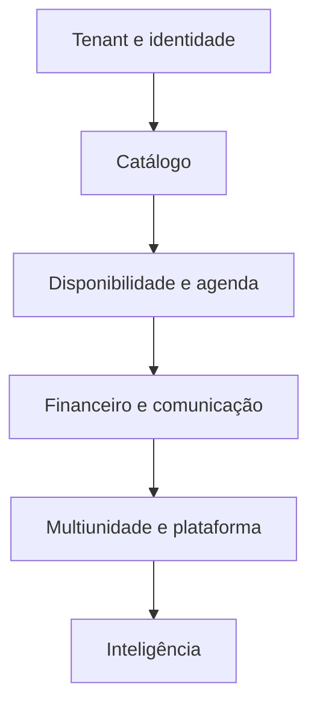

# Backlog de implementação por sprints

**ID:** DOC-ROAD-003  
**Status:** plano inicial sujeito a estimativa  
**Fonte canônica para:** sequência de trabalho e dependências

## 1. Premissas

- Sprint de duas semanas e equipe de cinco pessoas em dedicação integral.
- Números são sequência, não promessa de data.
- Cada sprint reserva capacidade para qualidade, documentação, DevOps e suporte.
- Entregas são fatias verticais: banco, backend, API, frontend, teste e operação.
- O [plano de três níveis](01-plano-tres-niveis.md) define o escopo; este arquivo apenas ordena.

## 2. Preparação

| Sprint | Objetivo | Entregas | Gate |
|---|---|---|---|
| S0 | baseline executável | validar documentação; resolver pendências bloqueadoras; criar repositórios, CODEOWNERS, pipeline inicial, ADRs e ambientes locais | manifesto e validador verdes; responsáveis P1–P5 nomeados |

## 3. Nível inicial — MVP

| Sprint | Objetivo | Fatias principais | Evidência |
|---|---|---|---|
| S1 | fundação segura | módulos, Flyway, tenant, unidade, autenticação, sessão, papéis, layout, tokens, CI e logs | login + isolamento automatizado |
| S2 | catálogo operacional | usuários, clientes, profissionais, serviços, arquivos e telas administrativas | CRUDs com permissão, auditoria e contrato |
| S3 | disponibilidade | jornada, pausa, bloqueio, slot e agenda diária/semanal | cálculo de slot e acessibilidade |
| S4 | ciclo da agenda | criar, editar, reagendar, cancelar, estados, itens, reserva pública | concorrência impede dupla reserva |
| S5 | capacidades avançadas do MVP | recorrência, fila de espera, comissão e notificações essenciais | série parcial, oferta atômica e snapshot |
| S6 | gestão e SaaS mínimo | dashboard, relatórios MVP, Super Admin, suspensão e saúde | totais reproduzíveis e tenant suspenso |
| S7 | endurecimento e piloto | carga, segurança, E2E, backup/restauração, runbooks, implantação e treinamento | gate MVP completo |

Pontos de integração:

- cliente TypeScript é gerado desde S1;
- testes de tenant entram em todo módulo a partir de S1;
- migration e telemetria acompanham cada história;
- piloto interno pode começar em S6, sem venda até o gate S7.

## 4. Nível mediano

| Sprint | Objetivo | Fatias principais | Evidência |
|---|---|---|---|
| S8 | caixa e recebimento | abertura, movimentos, fechamento, sinal registrado manualmente, pagamento dividido, desconto e comprovante | reconciliação por atendimento/caixa |
| S9 | estoque e venda | produtos, fornecedor, entrada, venda, consumo, perda, inventário e margem | saldo reproduzido do ledger |
| S10 | fidelidade | pontos, estorno, pacotes, planos do cliente e extrato | idempotência e validade |
| S11 | comunicação e CRM | consentimento, templates, segmentos, lembretes, WhatsApp e avaliação | opt-out e frequência respeitados |
| S12 | calendário e robustez de integração | OAuth Google, sincronização, webhooks, estado e retries | repetição/ordem não duplica efeito |
| S13 | assinatura SaaS | trial, plano, cobrança, limites, flags, cupons e suporte controlado | direitos e suspensão auditáveis |
| S14 | relatórios e operação repetível | relatórios financeiros/estoque/clientes, importação/exportação, SLO e onboarding | gate intermediário completo |

## 5. Nível final

| Sprint | Objetivo | Fatias principais | Evidência |
|---|---|---|---|
| S15 | autorização avançada | MFA sensível, papéis personalizados e escopo por unidade | matriz e cenários negativos |
| S16 | multiunidade | unidades, equipe, serviço, agenda e consolidação | isolamento + consolidação |
| S17 | pagamentos online | checkout de sinal ou total, gateway, webhook e conciliação | reprocessamento sem duplicidade |
| S18 | suprimentos em rede | pedido, recebimento, transferência e sugestão | ledger correlacionado |
| S19 | CRM automatizado | campanhas, gatilhos, frequência e atribuição | público e métricas reproduzíveis |
| S20 | plataforma aberta | API pública, chaves, limites e webhooks de saída | segurança e experiência de integrador |
| S21 | inteligência e escala | metas, dashboards, BI, previsões, carga e desastre | gate final completo |

## 6. Dependências críticas

| Dependência | Bloqueia |
|---|---|
| Política comercial e planos | assinatura SaaS, feature flags e proposta |
| Fornecedor de e-mail/WhatsApp | notificações externas e custo por plano |
| Gateway escolhido | sinal, pagamento online e conciliação |
| Domínios e contas Google | OAuth, calendário e avaliação |
| Política jurídica/LGPD | piloto externo e campanhas |
| Estratégia de infraestrutura | SLO, RPO/RTO, custo e escala |

## 7. Critério de replanejamento

Replanejar quando:

- descoberta altera regra ou público;
- dependência externa ultrapassa uma sprint;
- carry-over excede 20% por duas sprints;
- taxa de defeito ou incidente cresce;
- dívida operacional impede o SLO;
- estimativa acumulada desvia mais de 20%.

Ao replanejar, manter o gate, reduzir escopo de menor valor e atualizar IDs/release por decisão explícita. Não mascarar atraso removendo teste, segurança, documentação ou operação.
