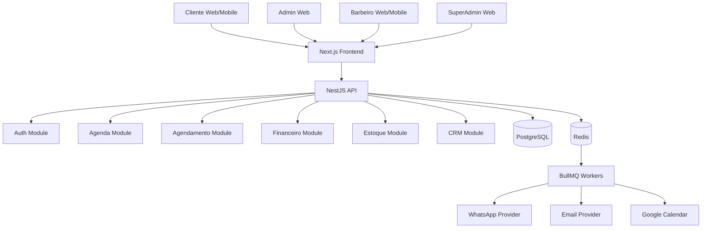

# 11 — Arquitetura Técnica

## Stack recomendada

## Backend

Opção recomendada:

- Node.js.
- NestJS.
- TypeScript.
- PostgreSQL.
- Prisma ORM ou TypeORM.
- Redis.
- BullMQ para filas.

Alternativa:

- Java.
- Spring Boot.
- PostgreSQL.
- Redis.
- Kafka ou RabbitMQ para eventos.

Para iniciar mais rápido, NestJS + PostgreSQL + Redis é uma boa escolha.

---

## Frontend

- Next.js.
- React.
- TypeScript.
- Tailwind CSS.
- React Hook Form.
- Zod.
- TanStack Query.

---

## Banco de dados

- PostgreSQL.

Motivos:

- Seguro.
- Robusto.
- Bom para SaaS.
- Bom para relatórios.
- Bom para regras relacionais.

---

## Cache e filas

- Redis.
- BullMQ.

Usos:

- Envio de WhatsApp.
- Lembretes.
- Geração de relatórios.
- Processamento de notificações.
- Jobs recorrentes.

---

## Arquitetura em camadas



---

## Multi-tenant

Como o sistema será SaaS, cada registro importante deve ter `barbershop_id`.

Exemplos:

- Usuários da barbearia.
- Clientes.
- Barbeiros.
- Serviços.
- Agendamentos.
- Produtos.
- Comissões.
- Notificações.

A API deve sempre validar se o usuário tem acesso àquela barbearia.

---

## Módulos backend sugeridos

```txt
src/
├── auth/
├── users/
├── barbershops/
├── barbers/
├── customers/
├── services/
├── schedules/
├── appointments/
├── recurring-appointments/
├── waiting-list/
├── products/
├── inventory/
├── commissions/
├── payments/
├── dashboards/
├── loyalty/
├── customer-plans/
├── notifications/
├── whatsapp/
├── google-calendar/
├── google-reviews/
├── devices/
├── subscriptions/
└── audit-logs/
```

---

## Padrão de API

A API deve seguir REST no início.

Exemplo:

- `GET /appointments`
- `POST /appointments`
- `PATCH /appointments/:id/cancel`
- `PATCH /appointments/:id/reschedule`
- `GET /dashboard/daily`

GraphQL não é necessário no início.

---

## Eventos internos

Eventos ajudam a separar regras.

Exemplos:

- `appointment.created`
- `appointment.cancelled`
- `appointment.rescheduled`
- `appointment.completed`
- `product.stock_low`
- `commission.generated`
- `customer.inactive`

Quando um agendamento for criado, o sistema pode disparar:

- Notificação interna.
- Mensagem WhatsApp para cliente.
- Mensagem WhatsApp para barbeiro.
- Mensagem para dono.
- Sincronização com Google Agenda.
