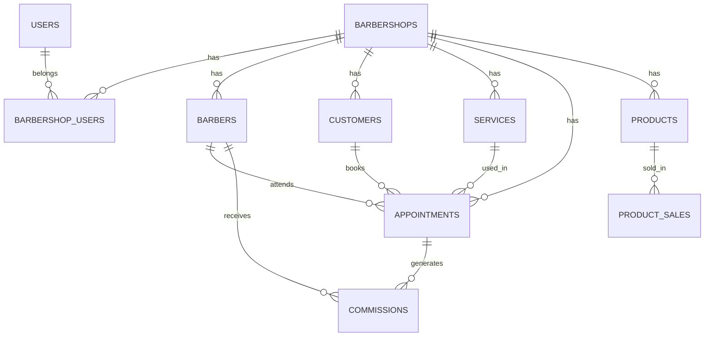

# 12 — Modelagem de Banco de Dados

## Observação

Esta modelagem é inicial e pode ser ajustada durante o desenvolvimento.

O objetivo é dar uma base clara para começar.

---

# Tabelas principais

## users

Usuários do sistema.

| Campo | Tipo | Observação |
|---|---|---|
| id | uuid | PK |
| name | varchar | Nome |
| email | varchar | Único |
| phone | varchar | Telefone/WhatsApp |
| password_hash | varchar | Senha criptografada |
| role | enum | SUPER_ADMIN, ADMIN, BARBER, CUSTOMER |
| status | enum | ACTIVE, BLOCKED, PENDING |
| created_at | timestamp | Data de criação |
| updated_at | timestamp | Data de atualização |

---

## barbershops

Barbearias cadastradas no SaaS.

| Campo | Tipo | Observação |
|---|---|---|
| id | uuid | PK |
| name | varchar | Nome fantasia |
| document | varchar | CPF/CNPJ |
| phone | varchar | Telefone |
| address | varchar | Endereço |
| google_review_url | text | Link de avaliação |
| subscription_plan_id | uuid | Plano SaaS |
| status | enum | ACTIVE, BLOCKED, TRIAL, OVERDUE |
| created_at | timestamp | Criação |
| updated_at | timestamp | Atualização |

---

## barbershop_users

Relaciona usuários com barbearias.

| Campo | Tipo | Observação |
|---|---|---|
| id | uuid | PK |
| barbershop_id | uuid | FK |
| user_id | uuid | FK |
| role | enum | ADMIN, BARBER, CUSTOMER |
| created_at | timestamp | Criação |

---

## barbers

Dados específicos do barbeiro.

| Campo | Tipo | Observação |
|---|---|---|
| id | uuid | PK |
| barbershop_id | uuid | FK |
| user_id | uuid | FK |
| default_commission_type | enum | PERCENTAGE, FIXED |
| default_commission_value | decimal | Valor |
| can_create_appointment | boolean | Permissão |
| can_cancel_appointment | boolean | Permissão |
| can_block_schedule | boolean | Permissão |
| can_view_revenue | boolean | Permissão |
| status | enum | ACTIVE, INACTIVE |

---

## customers

Clientes da barbearia.

| Campo | Tipo | Observação |
|---|---|---|
| id | uuid | PK |
| barbershop_id | uuid | FK |
| user_id | uuid | FK opcional |
| name | varchar | Nome |
| phone | varchar | WhatsApp |
| email | varchar | Opcional |
| birth_date | date | Opcional |
| notes | text | Observações |
| last_service_at | timestamp | Último atendimento |
| loyalty_points | int | Pontos |
| accepts_marketing | boolean | Aceite de marketing |
| status | enum | ACTIVE, INACTIVE, BLOCKED |

---

## services

Serviços da barbearia.

| Campo | Tipo | Observação |
|---|---|---|
| id | uuid | PK |
| barbershop_id | uuid | FK |
| name | varchar | Nome |
| description | text | Descrição |
| duration_minutes | int | Duração |
| price | decimal | Preço |
| commission_type | enum | PERCENTAGE, FIXED, DEFAULT_BARBER |
| commission_value | decimal | Valor |
| status | enum | ACTIVE, INACTIVE |

---

## barbershop_hours

Horário de funcionamento da barbearia.

| Campo | Tipo | Observação |
|---|---|---|
| id | uuid | PK |
| barbershop_id | uuid | FK |
| weekday | int | 0 domingo, 6 sábado |
| opens_at | time | Abertura |
| closes_at | time | Fechamento |
| is_closed | boolean | Fechado |

---

## barber_hours

Horário individual do barbeiro.

| Campo | Tipo | Observação |
|---|---|---|
| id | uuid | PK |
| barber_id | uuid | FK |
| weekday | int | Dia da semana |
| starts_at | time | Início |
| ends_at | time | Fim |
| break_starts_at | time | Início intervalo |
| break_ends_at | time | Fim intervalo |
| is_day_off | boolean | Folga |

---

## appointments

Agendamentos.

| Campo | Tipo | Observação |
|---|---|---|
| id | uuid | PK |
| barbershop_id | uuid | FK |
| customer_id | uuid | FK |
| barber_id | uuid | FK |
| service_id | uuid | FK |
| starts_at | timestamp | Início |
| ends_at | timestamp | Fim |
| status | enum | PENDING, CONFIRMED, CANCELLED, RESCHEDULED, IN_PROGRESS, COMPLETED, NO_SHOW, PAID |
| price | decimal | Valor |
| payment_status | enum | PENDING, PAID, REFUNDED |
| payment_method | enum | CASH, PIX, CARD, ONLINE |
| notes | text | Observações |
| recurrence_id | uuid | FK opcional |
| created_by_user_id | uuid | Quem criou |
| cancelled_reason | text | Motivo |

---

## schedule_blocks

Bloqueios de horário.

| Campo | Tipo | Observação |
|---|---|---|
| id | uuid | PK |
| barbershop_id | uuid | FK |
| barber_id | uuid | FK opcional |
| starts_at | timestamp | Início |
| ends_at | timestamp | Fim |
| reason | varchar | Motivo |
| created_by_user_id | uuid | Quem criou |

---

## recurring_appointments

Recorrências.

| Campo | Tipo | Observação |
|---|---|---|
| id | uuid | PK |
| barbershop_id | uuid | FK |
| customer_id | uuid | FK |
| barber_id | uuid | FK |
| service_id | uuid | FK |
| frequency | enum | WEEKLY, BIWEEKLY, MONTHLY |
| starts_on | date | Início |
| ends_on | date | Fim opcional |
| preferred_time | time | Horário |
| status | enum | ACTIVE, PAUSED, CANCELLED |

---

## waiting_list

Fila de espera.

| Campo | Tipo | Observação |
|---|---|---|
| id | uuid | PK |
| barbershop_id | uuid | FK |
| customer_id | uuid | FK |
| barber_id | uuid | Opcional |
| service_id | uuid | FK |
| desired_date | date | Data desejada |
| desired_period | enum | MORNING, AFTERNOON, EVENING, ANY |
| status | enum | WAITING, OFFERED, ACCEPTED, DECLINED, EXPIRED, CANCELLED |
| position | int | Posição |

---

## products

Produtos.

| Campo | Tipo | Observação |
|---|---|---|
| id | uuid | PK |
| barbershop_id | uuid | FK |
| name | varchar | Nome |
| category | varchar | Categoria |
| cost_price | decimal | Custo |
| sale_price | decimal | Venda |
| quantity | int | Estoque |
| minimum_quantity | int | Estoque mínimo |
| status | enum | ACTIVE, INACTIVE |

---

## product_sales

Vendas de produtos.

| Campo | Tipo | Observação |
|---|---|---|
| id | uuid | PK |
| barbershop_id | uuid | FK |
| product_id | uuid | FK |
| customer_id | uuid | Opcional |
| barber_id | uuid | Opcional |
| quantity | int | Quantidade |
| total_amount | decimal | Total |
| commission_amount | decimal | Comissão |
| sold_at | timestamp | Data |

---

## commissions

Comissões.

| Campo | Tipo | Observação |
|---|---|---|
| id | uuid | PK |
| barbershop_id | uuid | FK |
| barber_id | uuid | FK |
| appointment_id | uuid | Opcional |
| product_sale_id | uuid | Opcional |
| gross_amount | decimal | Valor bruto |
| commission_type | enum | PERCENTAGE, FIXED |
| commission_value | decimal | Valor configurado |
| commission_amount | decimal | Valor da comissão |
| status | enum | PENDING, PAID, CANCELLED, ADJUSTED |
| adjustment_reason | text | Motivo se houver |
| paid_at | timestamp | Data de pagamento |

---

## notifications

Notificações.

| Campo | Tipo | Observação |
|---|---|---|
| id | uuid | PK |
| barbershop_id | uuid | FK |
| user_id | uuid | FK |
| type | varchar | Tipo |
| channel | enum | INTERNAL, WHATSAPP, EMAIL, PUSH |
| title | varchar | Título |
| message | text | Mensagem |
| status | enum | PENDING, SENT, FAILED, READ |
| sent_at | timestamp | Envio |

---

## devices

Dispositivos autorizados.

| Campo | Tipo | Observação |
|---|---|---|
| id | uuid | PK |
| user_id | uuid | FK |
| barbershop_id | uuid | FK |
| device_fingerprint | varchar | Identificador |
| device_name | varchar | Nome |
| last_access_at | timestamp | Último acesso |
| status | enum | ACTIVE, BLOCKED, REMOVED |

---

## subscription_plans

Planos SaaS.

| Campo | Tipo | Observação |
|---|---|---|
| id | uuid | PK |
| name | varchar | Nome |
| price | decimal | Valor mensal |
| max_barbers | int | Limite |
| max_devices_per_barber | int | Limite |
| max_units | int | Limite |
| whatsapp_enabled | boolean | Permite WhatsApp |
| crm_enabled | boolean | Permite CRM |
| loyalty_enabled | boolean | Permite fidelidade |
| google_calendar_enabled | boolean | Permite Google Agenda |
| advanced_reports_enabled | boolean | Relatórios avançados |
| status | enum | ACTIVE, INACTIVE |

---

# Diagrama ER simplificado

