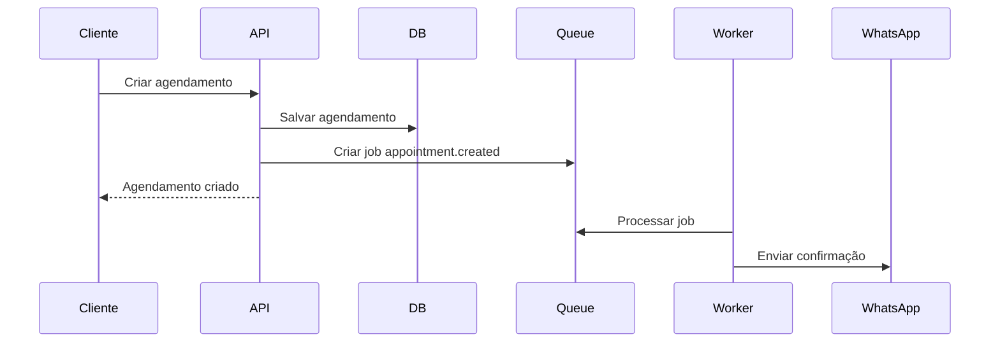

# 15 — Notificações, Filas e Jobs

## Por que usar filas?

Algumas tarefas não devem travar a resposta da API.

Exemplo:

Quando um cliente agenda um corte, a API deve criar o agendamento rapidamente e colocar mensagens em fila para serem enviadas depois.

---

## Tecnologias sugeridas

- Redis.
- BullMQ.
- Workers separados.

---

## Eventos que geram notificações

- Novo agendamento.
- Cancelamento.
- Reagendamento.
- Atendimento concluído.
- Cliente faltou.
- Cliente entrou na fila.
- Vaga liberada.
- Produto com estoque baixo.
- Comissão gerada.
- Comissão paga.
- Plano vencendo.
- Cliente inativo.

---

## Filas sugeridas

```txt
queues/
├── whatsapp.queue
├── email.queue
├── notification.queue
├── calendar-sync.queue
├── reports.queue
├── reminders.queue
└── billing.queue
```

---

## Jobs recorrentes

## Job de lembrete de atendimento

Roda a cada alguns minutos.

Verifica agendamentos que acontecerão em breve e envia lembrete.

Exemplo:

- Enviar lembrete 24h antes.
- Enviar lembrete 2h antes.

---

## Job de lembrete de corte

Roda diariamente.

Procura clientes que estão há X dias sem cortar.

Exemplo:

- Cliente cortou há 20 dias.
- Sistema envia mensagem convidando para agendar.

---

## Job de estoque baixo

Roda diariamente ou após venda.

Se produto estiver abaixo do mínimo, notifica o Admin.

---

## Job de fechamento diário

Roda no final do dia.

Gera resumo:

- Faturamento.
- Atendimentos.
- Produtos vendidos.
- Comissões.
- Cancelamentos.
- Faltas.

---

## Job de fila de espera

Quando um horário é cancelado, o sistema verifica se existe cliente na fila para aquela data/barbeiro.

Se existir, oferece a vaga ao primeiro da fila.

---

## Exemplo de fluxo com eventos


