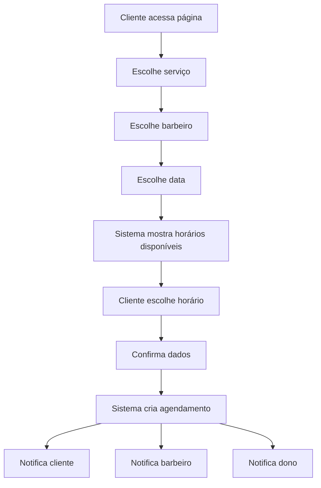
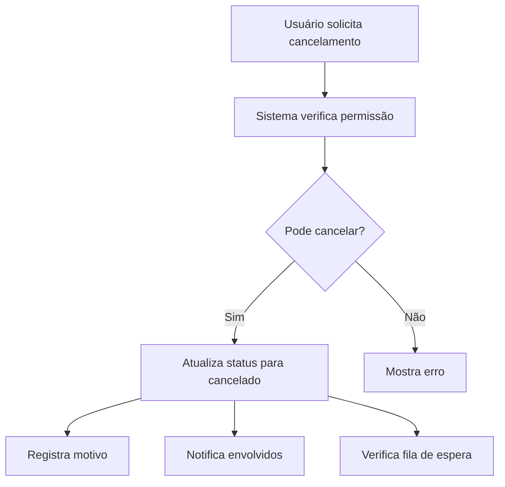
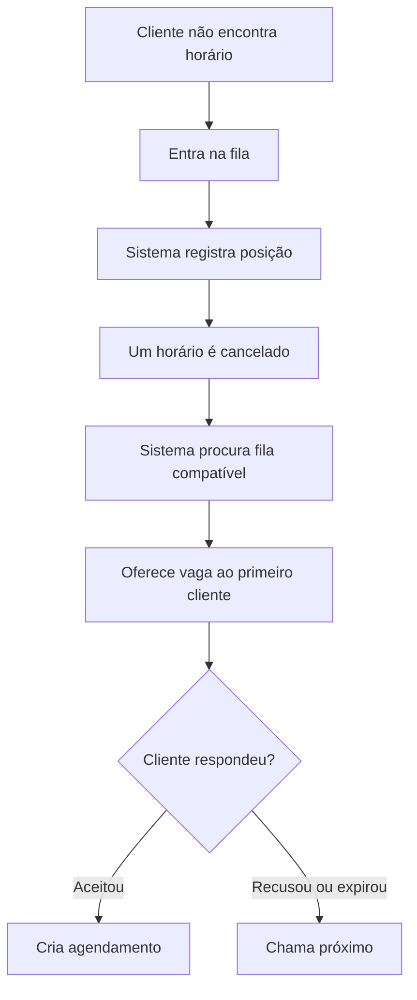
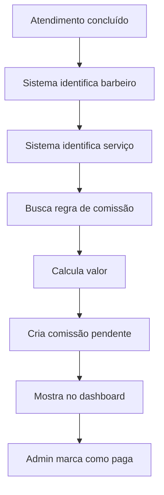
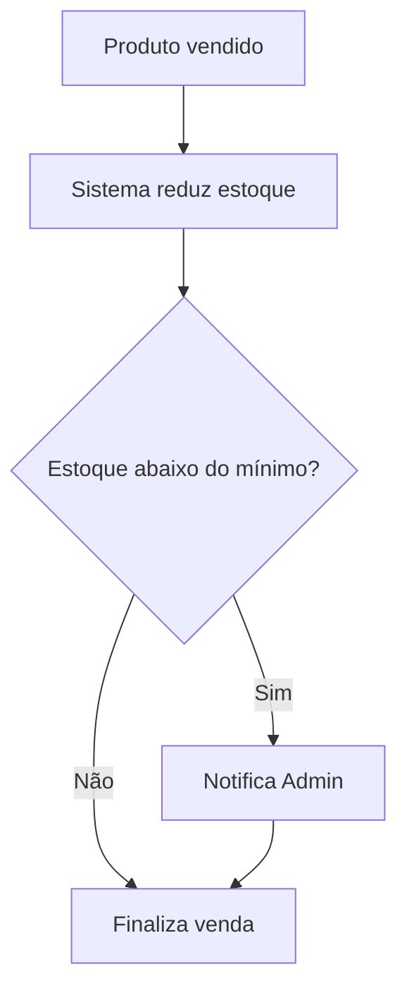
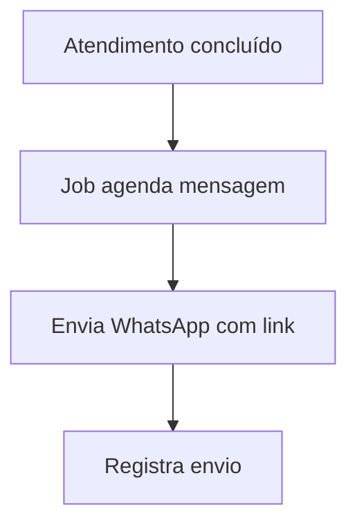
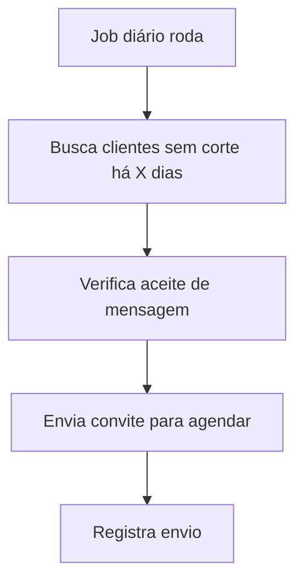
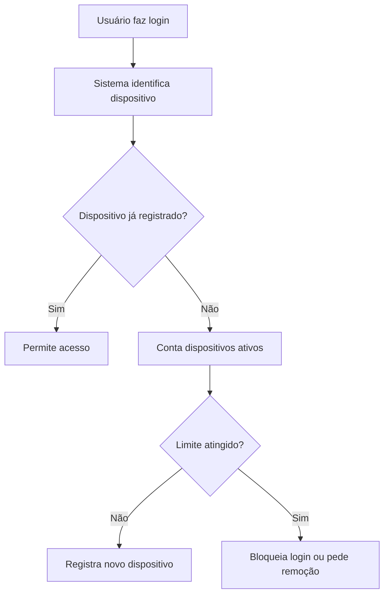

# 18 — Fluxos Principais

# 1. Fluxo de agendamento pelo cliente

---

# 2. Fluxo de cancelamento

---

# 3. Fluxo de fila de espera

---

# 4. Fluxo de comissão

---

# 5. Fluxo de estoque

---

# 6. Fluxo de avaliação Google

---

# 7. Fluxo de lembrete de corte

---

# 8. Fluxo de controle de dispositivos

